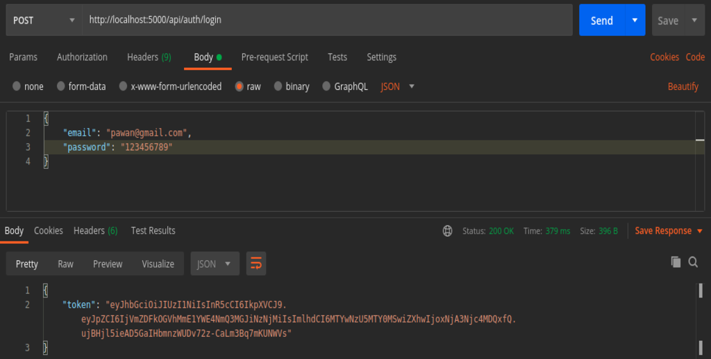
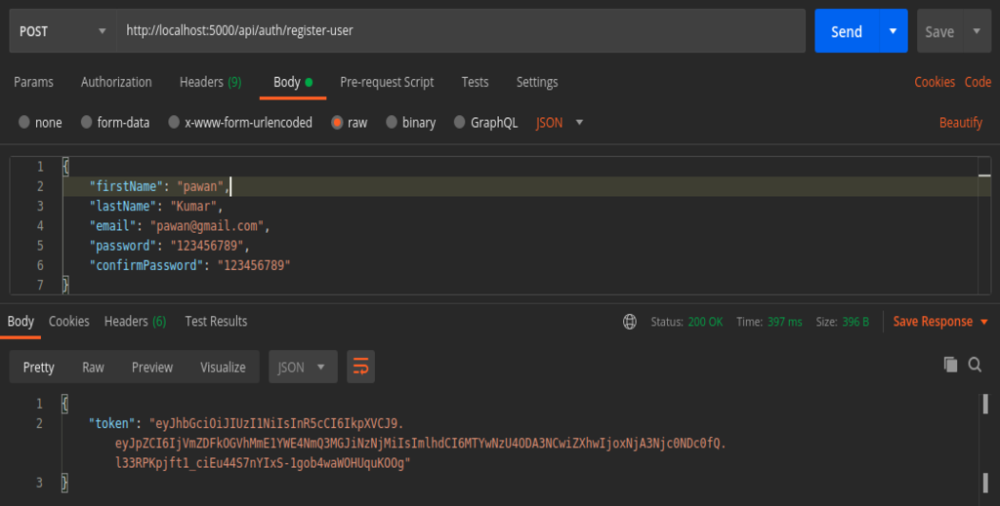
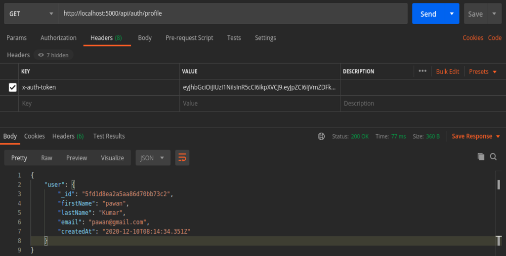
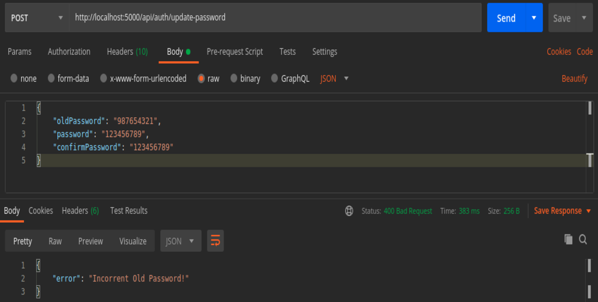

# Foodviraam Assignment

This is source code for the assigment provided by the Foodviraam.

---

## Prerequisites

All need is NodeJS and npm installed on your machine. You can download nodejs from [here](https://nodejs.org/en/download/ "NodeJS Download")

---

## Quick Start 🚀

1. Add a .env file in the root folder with the following
```
PORT=5000
MONGO_URI=<your mongodb uri with credentials>
JWT_SECRET=<your secret for Json Web Token>
``` 

2. Install dependencies

```bash
npm install
```

3. Run Application

```bash
npm run start
or
npm run server
```
---

## Screenshots

#### Login



#### Registration



#### Display profile



#### Update password


---
